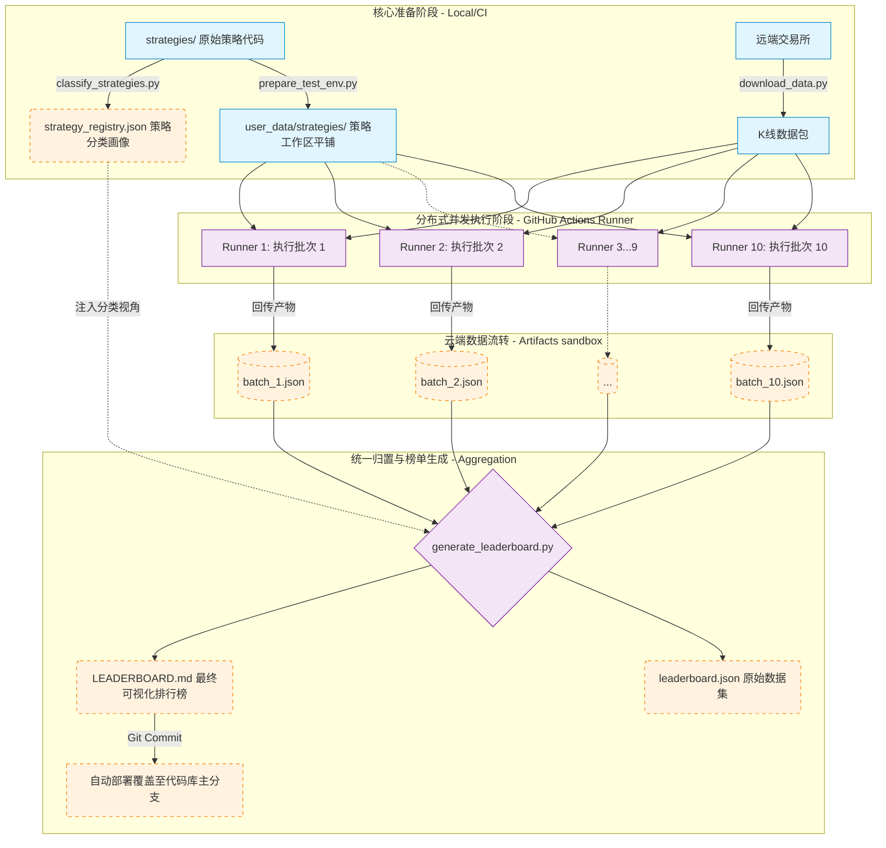

# Freqtrade 批量回测与 CI/CD 自动化设计方案

## 1. 背景与目标
在处理大量的 Freqtrade 交易策略（当前已达 465 个）时，单机串行回测存在耗时过长、对机器资源持续霸占以及极度依赖人工值守等痛点。为了提升策略评估效率，并实现无人值守的周期性长效评测，设计了本套支持分布式节点批量回测、具备自动化持续集成（CI/CD）能力并以自动化输出排行榜为最终制品的系统方案。

**核心目标：**
1. **策略自动提取与分类**：通过静态代码分析技术，全自动识别上百个策略底层的交易特征与适用的市场周期。
2. **分布式并行回测**：将庞大的策略包自动化平铺、切片并分发至多个不同的计算节点（CI/Runner）以并行计算，打破单机计算瓶颈。
3. **自动化数据汇总输出**：利用云原生 Runner 在全批次完成后自动执行结果的收取聚合，动态生成最终 Markdown 排行榜并自动落盘进代码仓库。

---

## 2. 总体运作架构

### 2.1 架构数据流传输图



该方案由五大核心阶段组成，兼具本地环境的易调试性与 GitHub Actions 云端体系的高并发性：

1. **自动化归类打标**（Registry）：梳理策略风格档案。
2. **数据时序完备性保障**（Data Sync & Check）：填补并校验所需的 K 线时间序列数据。
3. **执行环境隔离构建**（Flatten Environment）：将复杂的策略库及数据目录组装为符合 Freqtrade 原生约定的平铺型工作栈。
4. **横向扩展与批次调度**（Slice & Execute）：分桶计算避免内存/时间溢出。
5. **归并与可视化分档**（Aggregate & Leaderboard）：多维度排序并生成可视文档。

---

## 3. 核心功能及文件结构详解

### 3.1 策略分类系统 (`classify_strategies.py`)
- **功能**：静默扫描 `strategies/` 目录树中的所有 Python 源码，完成策略基建属性识别。
- **机制**：通过正则匹配引擎对各策略调用的技术指标（如 `ta.EMA`, `ta.MFI`）、定义的时间框架（`timeframe`）与特殊变量（如 `trailing_stop`）进行捕获。基于内置的经验规则权重，推断其风格（Trend / Momentum / Mean Reversion）以及市场拟合度（Trending / Ranging）。
- **产出**：输出结构化的 `strategy_registry.json`，为回测结果的类别交叉比对提供唯一参照源。

### 3.2 环境准备映射 (`prepare_test_env.py`)
- **功能**：处理从代码库结构向 Freqtrade 计算层结构的工程映射。
- **机制**：由子目录构建的项目管理方式不利于引擎挂载，此模块负责平铺所有活动策略并复制至一级的 `user_data/strategies/` 下。同时修复类名不匹配和 Freqtrade v3 兼容性问题。

### 3.3 批量切片调度系统 (`run_batch_backtests.py` & `run_all_batches.py`)
- **功能**：单机/多节点的任务分派中枢。
- **机制**：
  - 加载目录内已扫描到的策略列表，根据配置的总批次数（`--total-batches`）与当前执行索引（`--batch`）动态划取任务窗口（Slice）。
  - 创建并桥接对应的 Freqtrade 虚拟执行指令（支持 Docker 或 Native）。
  - 具备断点容灾能力：启用 `--skip-errors` 后，个别陈旧报错策略会被隔离剔除，保全同一批次剩余策略的正常算力闭环。
- **产出**：各计算分片完成时在 `user_data/backtest_results/` 落为独立的 `.json` 指标块。

### 3.4 最终排行榜引擎 (`generate_leaderboard.py`)
- **功能**：全域结果回收与加工呈现模块。
- **机制**：迭代搜集各批次的零散回测回执，抽取如总收益（Total Profit）、最大回撤（Max Drawdown）、夏普/索提诺比率（Sharpe/Sortino Ratio）、胜率（Win Rate）等骨干考核指标。深度融合 `strategy_registry.json` 中注入的元数据，使用排序算法完成名次重排，进而编排出具备 GitHub Flavored Markdown 警示块的精美文档。
- **产出**：人可读体验优良的 `LEADERBOARD.md` 及其全量数据溯源 `leaderboard.json`。

---

## 4. GitOps 与 CI/CD 分布式并发模型
该逻辑载体为 `.github/workflows/backtest_leaderboard.yml`，是解放生产力的云端中枢。

### 4.1 矩阵执行策略 (Matrix Operations)
配置利用 GitHub Actions 的 `strategy.matrix` 下发散列任务：
```yaml
strategy:
  matrix:
    batch: [1, 2, 3, 4, 5, 6, 7, 8, 9, 10]
```
系统启动时瞬时拉起 10 组虚拟环境并行。这意味着 100 小时的硬性计算时间可以随集群规模横向萎缩至 10 个小时。

### 4.2 制品流转 (Artifact Upload/Download)
批次计算节点完全互不通信以保证独立运行率。当单节点执行完毕后，调用 `actions/upload-artifact` 暂存这 N 个策略的回测包至 GitHub 平台中转区，构建数据流沙箱。

### 4.3 合并发布哨兵 (Commit & Push Job)
声明一个聚合收口的依赖任务节点：
```yaml
needs: [backtest] # 阻塞等待全部并发机器回传
```
它的生命周期仅在全部计算通过后引发，它会在沙箱中汇聚 `1-10` 批的全部暂存内容，调用 Python 聚合脚本完成榜单渲染。最后使用机器人认证进行原位 Git Commit 覆盖，完成“策略修改 -> 推送 -> 自动化测试排行 -> 结果更新到底层代码库”的终极闭环迭代。

---

## 5. 最终数据大盘 UI 设计 (Leaderboard Dashboard)

为了在同一个数据大盘体验中提供最佳的数据获取漏斗，系统将提供四层瀑布流布局的终极前端设计方案：

### 5.1 第一层：全局三维总冠仪表盘 (Hero Metric Cards)
页面由高亮聚焦卡片组构成，不管下方如何使用条件过滤，此区域始终展示全量策略中的极致表现者：
- 🥇 **Highest Profit (绝对收益王)**：带绿色强调色，展示绝对收益金额最大的策略。
- 🎯 **Best Win Rate (最高胜率王)**：蓝色强调色，带有靶心图标，展现胜负概率最均衡的胜者。
- 🛡️ **Lowest Drawdown (最佳风控王)**：橙红色强调色，盾牌标志，展现最大回撤最小、抗风险表现极佳的稳健选手。

### 5.2 第二层：细分条件筛选下的“热门精选” (Filtered Popular Strategies)
这里是满足用户快速圈选的轻量级检索模块。
- **动态标签筛选器 (Global Filters Bar)**：横向分布四个核心筛选组：策略类型（Category）、近期时间范围（Timeframe）、风险评级（Risk Level）、承受回撤层级（Drawdown）。支持极速组合点击。
- **精选推荐表 (Popular Strategies Table)**：基于筛选条件仅呈现 Top 5 ~ Top 10 的小样本推荐，配有跟随用户的“热度/Users”特征列，随着上方标签点选，动态过滤这 10 行热门数据。

### 5.3 第三层：不设限全维度龙虎总榜 (The Master Leaderboard)
在界面下方开启支持滚动的海量策略展示大图表区。
- 展示所有（如目前全量的 465 种）自动化分批测算的策略骨干数据。
- 保留高阶字段交互，每一列表头（Total Profit、Trades、Sharpe Ratio 等）均带有完整的正反双向强制排序功能（Sort）。高阶极客用户可以直接利用这些字段进行自定义检索排名。

### 5.4 第四层（底部）：策略科普走马灯 (Category Marquee)
界面底部紧贴边界设计一个全宽自动慢速滚动的卡片墙（Carousel）。
- 该区域放映各种量化大类的简要术语百科（趋势跟踪、均值回归、动量突破、剥头皮等）。
- **交互赋能**：当点击任意常识科普卡片时，页面会向上平滑反滚，同时由系统自动点亮上方第二层的对应标签，直接为该类型的实操表现呈具象例子。这构成了从认知发现到检索决策的终结级用户闭环。
